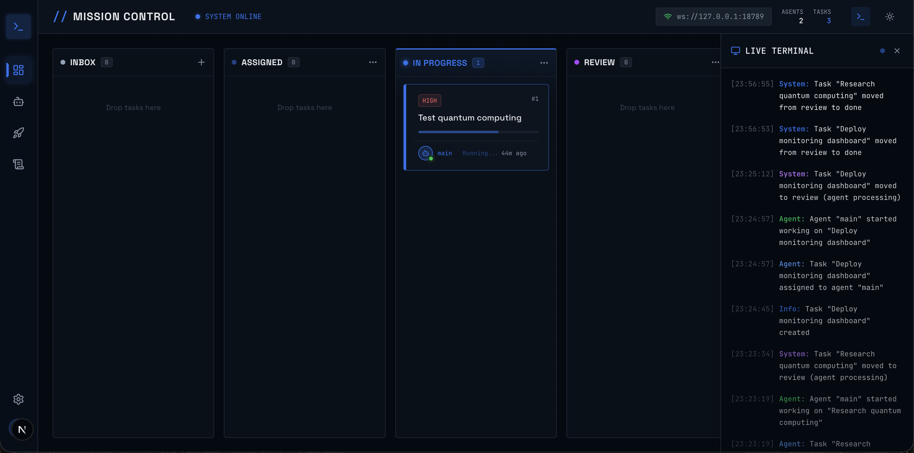

<p align="center">
  
</p>

<h1 align="center">// MISSION CONTROL</h1>

<p align="center">
  <strong>A real-time dashboard to manage, monitor, and orchestrate your AI agents</strong>
</p>

<p align="center">
  <a href="#-quick-start">Quick Start</a> •
  <a href="#-features">Features</a> •
  <a href="#%EF%B8%8F-setup">Setup</a> •
  <a href="#-tech-stack">Tech Stack</a> •
  <a href="#-contributing">Contributing</a>
</p>

<p align="center">
  
  
  
  
  
</p>

---

**Mission Control** is an open-source, real-time command-center dashboard for [OpenClaw](https://github.com/openclaw/openclaw) — the open-source AI agent framework. It gives you a visual interface to create tasks, dispatch them to AI agents, monitor agent activity, and track progress through a Kanban-style workflow.

Think of it as **your personal AI operations center** — a single pane of glass for everything your AI agents are doing.

---

## 🚀 Quick Start

Run Mission Control instantly with a single command — no cloning required:

```bash
npx openclaw-mission-control
```

The interactive setup wizard will ask for:

| Prompt          | Default                | Description                                   |
| --------------- | ---------------------- | --------------------------------------------- |
| **Gateway URL** | `ws://127.0.0.1:18789` | Your OpenClaw gateway WebSocket address       |
| **Auth Token**  | —                      | Authentication token from your gateway config |
| **Port**        | `3000`                 | Port to serve the dashboard on                |

Once configured, Mission Control starts in **under 1 second** and opens at `http://localhost:3000`.

---

## ✨ Features

### 📋 Kanban Task Board

Organize AI agent work across five workflow stages with drag-and-drop:

- **Inbox** → **Assigned** → **In Progress** → **Review** → **Done**
- Create tasks with priority levels (Low, Medium, High, Urgent)
- Drag tasks between columns to update status
- Task cards show assigned agent, priority badge, and time elapsed

### 🤖 Agent Monitoring

- Real-time agent status (Online / Offline / Busy)
- View connected agents with model info and capabilities
- Dispatch tasks directly to specific agents
- Track which agent is working on what

### 📡 Live Terminal

- Floating, collapsible terminal panel (slides from right)
- Real-time activity feed with color-coded entries
- Timestamps for every event (task created, agent assigned, status changes)
- Toggle visibility with the terminal button in the header

### 🎯 Mission Management

- Group related tasks into missions
- Track mission progress and completion status
- Organize complex multi-task workflows

### 🌗 Dark & Light Mode

- Beautiful dark mode with glassmorphism effects (default)
- Clean light mode with proper contrast
- One-click toggle in the header

### ⚡ Real-Time Sync

- WebSocket connection to OpenClaw gateway
- Live status indicator (System Online / Offline)
- Auto-reconnection on connection loss
- Instant UI updates when agents complete work

---

## ⚙️ Setup

### Prerequisites

- **Node.js** 18+ ([download](https://nodejs.org/))
- **OpenClaw Gateway** running locally or remotely ([setup guide](https://github.com/openclaw/openclaw))

### Option 1: npx (Recommended)

```bash
npx openclaw-mission-control
```

No installation required. The wizard handles everything.

### Option 2: Clone & Run

```bash
# Clone the repository
git clone https://github.com/openclaw/openclaw.git
cd openclaw/mission-control

# Install dependencies
npm install

# Configure environment
cp .env.example .env.local
```

Edit `.env.local` with your settings:

```env
# OpenClaw Gateway
OPENCLAW_GATEWAY_URL=ws://127.0.0.1:18789
OPENCLAW_AUTH_TOKEN=your_auth_token_here
```

Start the development server:

```bash
npm run dev
```

Open [http://localhost:3000](http://localhost:3000) in your browser.

### Option 3: Production Build

```bash
npm run build
npm start
```

The production build uses Next.js standalone output for minimal footprint and fast startup (~35ms).

---

## 🔧 Configuration

| Environment Variable   | Required | Default                | Description                                |
| ---------------------- | -------- | ---------------------- | ------------------------------------------ |
| `OPENCLAW_GATEWAY_URL` | No       | `ws://127.0.0.1:18789` | WebSocket URL of your OpenClaw gateway     |
| `OPENCLAW_AUTH_TOKEN`  | Yes      | —                      | Auth token from your gateway's config file |
| `PORT`                 | No       | `3000`                 | Port number for the dashboard              |

### Finding Your Auth Token

Your OpenClaw auth token is in your gateway configuration file (usually `~/.clawdbot/clawdbot.json`):

```json
{
  "auth_token": "your_token_here"
}
```

---

## 🏗️ Tech Stack

| Technology                                      | Purpose                                         |
| ----------------------------------------------- | ----------------------------------------------- |
| [Next.js 16](https://nextjs.org/)               | Full-stack React framework with App Router      |
| [React 19](https://react.dev/)                  | UI components with React Compiler               |
| [TypeScript 5](https://www.typescriptlang.org/) | Type-safe development                           |
| [Tailwind CSS 4](https://tailwindcss.com/)      | Utility-first styling                           |
| [Radix UI](https://www.radix-ui.com/)           | Accessible, unstyled UI primitives              |
| [shadcn/ui](https://ui.shadcn.com/)             | Pre-built component library                     |
| [SQLite](https://www.sqlite.org/)               | Lightweight local database (via better-sqlite3) |
| [dnd-kit](https://dndkit.com/)                  | Drag-and-drop for Kanban board                  |
| [Lucide Icons](https://lucide.dev/)             | Beautiful icon set                              |

### Project Structure

```
mission-control/
├── bin/
│   └── cli.mjs              # npx entry point & setup wizard
├── src/
│   ├── app/
│   │   ├── page.tsx          # Main dashboard (Kanban, Agents, Missions)
│   │   ├── globals.css       # Design tokens & theme variables
│   │   └── api/
│   │       ├── tasks/        # CRUD + dispatch + comments
│   │       ├── agents/       # Agent listing from gateway
│   │       ├── missions/     # Mission management
│   │       ├── activity/     # Activity log feed
│   │       └── openclaw/     # Gateway status endpoint
│   ├── components/           # Reusable UI components (shadcn)
│   └── lib/
│       ├── db.ts             # SQLite database & schema
│       └── openclaw-client.ts # WebSocket client for gateway
├── data/                     # SQLite database (auto-created)
└── public/                   # Static assets
```

---

## 📚 API Reference

Mission Control exposes REST API endpoints for programmatic access:

| Method     | Endpoint               | Description                                           |
| ---------- | ---------------------- | ----------------------------------------------------- |
| `GET`      | `/api/tasks`           | List all tasks (filterable by status, agent, mission) |
| `POST`     | `/api/tasks`           | Create a new task                                     |
| `PATCH`    | `/api/tasks`           | Update task fields (status, priority, assignment)     |
| `DELETE`   | `/api/tasks`           | Delete a task                                         |
| `POST`     | `/api/tasks/dispatch`  | Dispatch a task to an AI agent                        |
| `GET/POST` | `/api/tasks/comments`  | List or add task comments                             |
| `GET`      | `/api/agents`          | List connected agents from gateway                    |
| `GET`      | `/api/missions`        | List all missions                                     |
| `POST`     | `/api/missions`        | Create a new mission                                  |
| `GET`      | `/api/activity`        | Get recent activity log                               |
| `GET`      | `/api/openclaw/status` | Check gateway connection status                       |

---

## 🤝 Contributing

Contributions are welcome! Here's how to get started:

1. **Fork** the repository
2. **Clone** your fork: `git clone https://github.com/your-username/openclaw.git`
3. **Create a branch**: `git checkout -b feature/your-feature`
4. **Make changes** and test locally
5. **Submit a Pull Request**

### Development

```bash
# Install dependencies
npm install

# Start dev server with hot-reload
npm run dev

# Run linter
npm run lint

# Production build
npm run build
```

---

## 📄 License

This project is licensed under the [MIT License](../LICENSE).

---

## 🔗 Links

- [OpenClaw Framework](https://github.com/openclaw/openclaw) — The AI agent framework
- [OpenClaw Website](https://openclaw.ai/) — Official website
- [Report a Bug](https://github.com/openclaw/openclaw/issues) — Found an issue? Let us know
- [Request a Feature](https://github.com/openclaw/openclaw/issues) — Have an idea? We'd love to hear it

---

<p align="center">
  Built with ❤️ for the AI agent community
</p>
